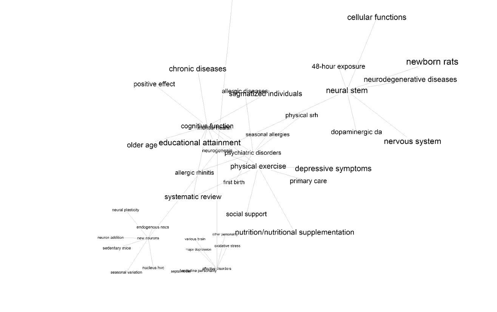

SciMapper is a way to visualize a scientific concept's linguistic space.
It takes a central search term, scrapes the abstracts of the most relevant articles and performs basic natural language processing to identify likely related concepts.
It then performs the same function on each of these extracted terms to generate a network of connections between all concepts.

Currently only PubMed Central is being utilized, which focuses mainly on biological journal articles (however a diverse sampling of over 5 million articles are present).

It is powered with Python and the [3D Force-Directed Graph](https://github.com/vasturiano/3d-force-graph) JavaScript library.   

TODO:
Add depth/breadth slider